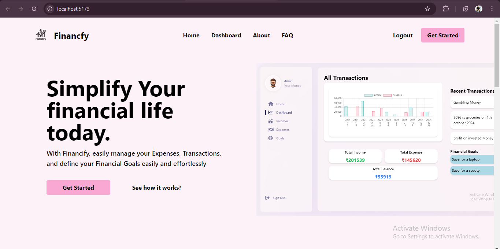
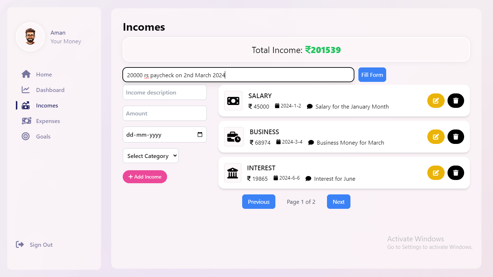

---

# SmartFinanceTracker

## Overview

SmartFinanceTracker is a comprehensive web application designed to help users manage their finances effectively. The application offers features like income and expense tracking, financial goal setting, and transaction management. The project utilizes a combination of modern technologies, including Spring Boot for the backend and React for the frontend, along with AI and ML functionalities to enhance financial insights and decision-making.

## Features

- **User Management**
  - Secure user registration and authentication.
  - Profile management.
  
- **Income Management**
  - API for adding, updating, and deleting income entries.
  - Calculation and display of total income.
  - Pagination support for income entries.
  
- **Expense Management**
  - API for adding, updating, and deleting expense entries.
  - Categorization of expenses.
  - Calculation and display of total expenses.
  
- **Transaction Management**
  - Overview of recent transactions.
  - Graphical representation of income vs. expenses.
  - Support for displaying and managing transactions based on income and expense data.
  
- **Financial Goals**
  - Set, update, and track progress towards financial goals.
  
- **AI & ML Integration**
  - Implementation of AI and ML functionalities to provide personalized financial advice.
  - **Automatic Form Fillup:** Use ML to automatically categorize transactions and fill up forms based on user input descriptions.

## Screenshots

### Home Page


### Dashboard


### Adding Income


## Technologies Used

### Frontend
- React
- Tailwind CSS for styling
- Axios for HTTP requests

### Backend
- Java Spring Boot
- MySQL for database management
- Spring Data JPA for database interaction
- Spring Security for authentication and authorization

### Tools & Libraries
- Formik for form management
- Springfox for API documentation
- `privateAxios` for authenticated HTTP requests

## Project Structure

### Backend
- **Controller:** Handles incoming HTTP requests and returns responses.
- **Service:** Contains business logic.
- **Service Implementation:** Implements service interfaces.
- **Repository:** Interfaces with the database.

### Frontend
- **components/Income:** Manages and displays user income.
- **components/Transaction:** Handles transaction-related functionalities including graphical representation and recent transactions.
- **components/Navigation:** Sidebar navigation for the application.

## API Endpoints

### User API
- `/api/users`: User registration and authentication.

### Income API
- `/api/incomes`: CRUD operations for income management.
- `/api/incomes/total`: Fetch total income.

### Expense API
- `/api/expenses`: CRUD operations for expense management.

### Transaction API
- `/api/transactions`: Fetch and manage transactions.

### Financial Goals API
- `/api/goals`: Set, update, and track financial goals.

## Setup & Installation

### Clone the repository

```bash
git clone https://github.com/Aman2809/SmartFinanceTracker.git
```

### Backend Setup

1. Navigate to the backend directory.
2. Make sure you have JDK and Maven installed.
3. Update the `application.properties` file with your MySQL credentials.
4. Run the Spring Boot application.

```bash
mvn spring-boot:run
```

### Frontend Setup

1. Navigate to the frontend directory.
2. Install the necessary dependencies.

```bash
npm install
```

3. Start the React application.

```bash
npm start
```

### Access the Application

Open your browser and navigate to `http://localhost:5173`.

## Future Enhancements

- Advanced AI/ML functionalities for more accurate financial predictions.
- Mobile responsiveness and PWA capabilities.
- Integration with third-party financial services for real-time data.

## Contributing

Contributions are welcome! Please submit a pull request or open an issue to discuss any changes.

## License

This project is licensed under the MIT License.

## Contact

For any queries or issues, feel free to contact me at jhaaman1005@gmail.com.

---
